# Rapport de Projet — Backtest Long/Short Market-Neutral sur le S&P 500

## Infrastructure de Backtest basée sur Bloomberg API (Python)

**Master 2 Finance Quantitative — Semestre 2**

---

## Table des matières

1. [Introduction et Objectif](#1-introduction-et-objectif)
2. [Architecture du Projet](#2-architecture-du-projet)
3. [Données](#3-données)
4. [Signaux de Trading](#4-signaux-de-trading)
5. [Méthodes d'Allocation](#5-méthodes-dallocation)
6. [Gestion des Risques — Stop-Loss](#6-gestion-des-risques--stop-loss)
7. [Coûts de Transaction](#7-coûts-de-transaction)
8. [Moteur de Backtest](#8-moteur-de-backtest)
9. [Métriques de Performance](#9-métriques-de-performance)
10. [Résultats et Graphiques](#10-résultats-et-graphiques)
11. [Conclusion](#11-conclusion)

---

## 1. Introduction et Objectif

Ce projet a pour objectif de construire une **infrastructure de backtest complète** en Python pour tester des **stratégies Long/Short market-neutral** sur l'univers des actions du **S&P 500**.

### Cadre de la stratégie

- **Type** : Long/Short market-neutral (exposition dollar neutre : $\Sigma w_{long} = +1$, $\Sigma w_{short} = -1$)
- **Univers** : Composantes du S&P 500 (actions US large-cap)
- **Fréquence** : Rebalancement **mensuel** (fin de mois)
- **Période** : Janvier 2016 — Décembre 2025 (~10 ans)
- **Source de données** : Bloomberg API (xbbg / blpapi), avec export Excel pour le mode offline

### Combinaisons testées

Le backtest exécute toutes les combinaisons possibles :

| Dimension | Options |
|-----------|---------|
| **Signaux** (3) | Momentum 12m-1m, Mean Reversion (volatilité), Vol Spread |
| **Allocations** (2) | Equal Weight, Equal Risk Contribution (ERC) |
| **Stop-Loss** (4) | Position, Trailing, Portfolio, Volatility-based |

Soit **3 × 2 × 4 = 24 stratégies** possibles (par défaut, seul le stop-loss "position" est activé, donnant 6 stratégies).

---

## 2. Architecture du Projet

Le projet est organisé en **modules Python spécialisés**, chacun responsable d'une fonctionnalité distincte :

```
project/
│
├── main.py              # Point d'entrée principal — orchestre le pipeline complet
├── config.py            # Paramètres globaux (dates, coûts, seuils, chemins)
├── bloomberg.py         # Wrapper Bloomberg API (BDH, BDP, composition d'indice)
├── data_loader.py       # Chargement et nettoyage des données depuis Excel
├── signals.py           # Calcul des 3 signaux cross-section
├── allocation.py        # Méthodes d'allocation market-neutral (EW, ERC)
├── risk.py              # 4 variantes de stop-loss / risk management
├── costs.py             # Calcul du turnover et des coûts de transaction
├── backtest.py          # Moteur de backtest (boucle de rebalancement)
├── metrics.py           # Indicateurs de performance (Sharpe, DD, VaR, etc.)
├── visualization.py     # Graphiques et export des résultats
├── Data.ipynb           # Notebook d'extraction Bloomberg
│
├── data_cache/          # Cache des données (fichier Excel Bloomberg)
│   └── data.xlsx
├── outputs/             # Résultats générés
│   ├── backtest_results.xlsx
│   ├── equity_curves.png
│   ├── drawdowns.png
│   ├── rolling_sharpe.png
│   ├── return_histograms.png
│   ├── monthly_heatmaps.png
│   ├── turnover.png
│   ├── correlation_matrix.png
│   ├── annual_returns.png
│   ├── exposure.png
│   ├── qq_plots.png
│   └── underwater.png
└── __pycache__/
```

### Flux d'exécution (Pipeline)

```
┌─────────────┐     ┌──────────────┐     ┌────────────┐     ┌─────────────┐
│  Bloomberg   │────▶│ data_loader  │────▶│  signals   │────▶│ allocation  │
│  (extraction)│     │  (nettoyage) │     │  (scoring) │     │   (poids)   │
└─────────────┘     └──────────────┘     └────────────┘     └─────────────┘
                                                                   │
                    ┌──────────────┐     ┌────────────┐            ▼
                    │   metrics    │◀────│  backtest   │◀───── risk.py
                    │  (perf.)     │     │  (moteur)   │      (stop-loss)
                    └──────────────┘     └────────────┘
                           │                    │
                           ▼                    ▼
                    ┌──────────────┐     ┌────────────┐
                    │visualization │     │   costs    │
                    │  (graphiques)│     │(transaction)│
                    └──────────────┘     └────────────┘
```

### Pipeline dans `main.py`

Le point d'entrée `main.py` exécute 4 étapes séquentielles :

1. **Chargement des données** (`load_all()`) — prix, rendements, taux sans risque
2. **Lancement des backtests** (`run_all_strategies()`) — toutes les combinaisons signal × allocation × stop-loss
3. **Calcul des métriques** (`summary_table()`) — tableau comparatif
4. **Graphiques et export** — 11 visualisations + export Excel

---

## 3. Données

### 3.1 Sources de données

Les données sont extraites de **Bloomberg Terminal** via l'API `xbbg/blpapi` et stockées dans un fichier Excel multi-feuilles :

| Feuille Excel | Contenu | Format |
|---------------|---------|--------|
| `SPX_Components` | Prix mensuels de chaque composante du S&P 500 | Format long : `date \| ticker \| PX_LAST` |
| `SPX_PX_LAST_Monthly` | Indice S&P 500 (PX_LAST mensuel) | `date \| spx_px_last` |
| `SPX_PX_LAST_Daily` | Indice S&P 500 (PX_LAST quotidien) | `date \| spx_px_last` |
| `TAUX_SANS_RISQUE` | US Treasury Bill 3 mois (taux annualisé %) | `date \| US Treasury Bill 3M` |

### 3.2 Convention de données

Conformément aux exigences du projet ("une page par field, colonnes tickers, lignes dates") :

- **Format interne** : `DataFrame(index=dates, columns=tickers, values=PX_LAST)`
- Les données brutes en format long sont pivotées en matrice via `pivot_prices()`
- Les rendements simples mensuels sont calculés : $r_t = \frac{P_t - P_{t-1}}{P_{t-1}}$

### 3.3 Nettoyage et filtrage de l'univers

Le module `data_loader.py` applique un filtrage rigoureux :

- **Historique minimum** : au moins **12 mois** d'observations non-NaN (`MIN_HISTORY_MONTHS = 12`)
- **Taux de NaN maximum** : pas plus de 30% de valeurs manquantes sur la période
- **Survivorship bias** : la composition de l'indice est reconstituée à chaque date de rebalancement pour éviter le biais du survivant

### 3.4 Taux sans risque

Le taux sans risque est le **US Treasury Bill 3 mois**, chargé dynamiquement :
- Conversion : $r_{f,mensuel} = \frac{r_{f,annuel\%}}{100 \times 12}$
- Utilisé dans le calcul du Sharpe Ratio et du Sortino Ratio

### 3.5 Extraction Bloomberg (`bloomberg.py`)

Le module Bloomberg fournit les fonctions clés :

| Fonction | Description |
|----------|-------------|
| `bdh(tickers, fields, start, end)` | Historical Data — prix, volumes (équivalent BDH Excel) |
| `bdp(tickers, fields)` | Reference Data — données fondamentales (P/E, EPS) |
| `get_index_members(index, date)` | Composition d'un indice à une date donnée (BDS) |
| `get_px_last_asof(tickers, date)` | Prix PX_LAST au plus proche d'une date |
| `get_spx_monthly(dates)` | SPX PX_LAST mensuel sur une plage de dates |
| `extract_full_universe(...)` | Pipeline complet d'extraction → export Excel |

Les appels Bloomberg sont découpés en **chunks de 150 tickers** pour respecter les limites de l'API.

---

## 4. Signaux de Trading

Le module `signals.py` implémente **3 signaux cross-section** basés uniquement sur les prix. À chaque date de rebalancement, chaque signal attribue un score à chaque action de l'univers, puis les actions sont classées en **buckets Long (top 20%) et Short (bottom 20%)**.

### 4.1 Momentum 12m − 1m

**Principe** : Acheter les gagnants récents, vendre les perdants récents, en excluant le dernier mois pour éviter l'effet de reversal à court terme.

$$\text{Signal}_i = \left(\frac{P_{i,t}}{P_{i,t-12}} - 1\right) - \left(\frac{P_{i,t}}{P_{i,t-1}} - 1\right)$$

- **Long** : Top 20% des scores (actions avec le plus fort momentum)
- **Short** : Bottom 20% des scores (actions avec le plus faible momentum)

### 4.2 Mean Reversion de Volatilité

**Principe** : La volatilité est un processus fortement mean-reverting. Après un pic de volatilité, celle-ci tend à se normaliser. Ce signal exploite cette propriété.

**Calcul en 3 étapes** :
1. Volatilité réalisée courte (3 derniers mois) : $\sigma_{short}$
2. Volatilité réalisée longue (12 derniers mois) : $\sigma_{long}$
3. Ratio : $\text{Ratio} = \frac{\sigma_{short}}{\sigma_{long}}$

$$\text{Signal}_i = -\text{Ratio}_i$$

- **Ratio bas** → volatilité en compression (retour au calme) → **LONG**
- **Ratio haut** → volatilité en expansion (turbulence récente) → **SHORT**

**Différence avec le Vol Spread** : Le Vol Spread classe par le **niveau** absolu de volatilité, tandis que le Mean Reversion classe par la **dynamique** (changement relatif) de la volatilité.

### 4.3 Vol Spread (Low Volatility)

**Principe** : Les actions à faible volatilité tendent à surperformer sur le long terme (anomalie bien documentée dans la littérature académique : "Low Volatility Anomaly").

$$\text{Signal}_i = -\sigma_i^{12m}$$

où $\sigma_i^{12m}$ est l'écart-type des rendements mensuels sur les 12 derniers mois.

- **Long** : Actions les moins volatiles (score élevé car signal inversé)
- **Short** : Actions les plus volatiles

### 4.4 Construction des buckets

La fonction `make_long_short_buckets()` sépare les actions en deux groupes :
- **Long** : actions dont le score ≥ quantile $(1 - q_{long})$ = 80ème percentile
- **Short** : actions dont le score ≤ quantile $q_{short}$ = 20ème percentile

Paramètres configurables dans `config.py` :
- `QUANTILE_LONG = 0.20` (top 20%)
- `QUANTILE_SHORT = 0.20` (bottom 20%)

---

## 5. Méthodes d'Allocation

Le module `allocation.py` transforme les listes Long/Short en **vecteurs de poids** respectant la contrainte market-neutral.

**Contrainte fondamentale** :

$$\sum_{i \in \text{Long}} w_i = +1 \quad \text{et} \quad \sum_{i \in \text{Short}} w_i = -1$$

### 5.1 Equal Weight (EW)

Allocation la plus simple :

$$w_i^{long} = +\frac{1}{n_{long}}, \quad w_i^{short} = -\frac{1}{n_{short}}$$

### 5.2 Equal Risk Contribution (ERC)

L'allocation ERC vise à ce que **chaque position contribue de manière égale au risque total du portefeuille**.

**Formulation mathématique** :

$$\min_w \sum_{i} \sum_{j} \left( w_i \cdot (\Sigma w)_i - w_j \cdot (\Sigma w)_j \right)^2$$

sous contraintes $\sum w_i = 1$, $w_i > 0$.

**Implémentation** :
- La matrice de covariance est estimée sur les **12 dernières observations** mensuelles
- L'optimisation est résolue séparément pour le côté Long et le côté Short (via `scipy.optimize.minimize`, méthode SLSQP)
- Si l'optimisation échoue ou s'il n'y a pas assez de données, un **fallback vers Equal Weight** est appliqué

---

## 6. Gestion des Risques — Stop-Loss

Le module `risk.py` implémente **4 variantes de stop-loss** pour contrôler les pertes :

### 6.1 Stop-Loss par Position (Absolu)

Ferme une position si la perte depuis le prix d'entrée dépasse un seuil.

$$\text{Si } \frac{P_{current}}{P_{entry}} - 1 < -10\% \Rightarrow \text{fermer la position}$$

- **Seuil** : −10% (`STOPLOSS_POSITION = -0.10`)
- S'applique aux positions **Long** (baisse du prix) et aux positions **Short** (hausse du prix)

### 6.2 Stop-Loss Trailing

Ferme une position si le prix recule de plus de X% depuis son plus haut (Long) ou remonte de plus de X% depuis son plus bas (Short).

$$\text{Long : } \frac{P_{current}}{P_{peak}} - 1 < -8\%$$

- **Seuil** : −8% (`STOPLOSS_TRAILING = -0.08`)

### 6.3 Stop-Loss Portefeuille (Drawdown Max)

Si le drawdown global du portefeuille dépasse un seuil, **toutes les positions sont réduites de moitié** (deleveraging).

$$\text{Si } \frac{NAV}{NAV_{peak}} - 1 < -15\% \Rightarrow w_i \leftarrow 0.5 \times w_i$$

- **Seuil** : −15% (`STOPLOSS_PORTFOLIO = -0.15`)

### 6.4 Stop-Loss Volatility-Based

Réduit l'exposition proportionnellement si la volatilité réalisée récente dépasse un multiple de la volatilité cible.

$$\text{Si } \sigma_{recent} > k \times \sigma_{target} \Rightarrow w_i \leftarrow \frac{\sigma_{target}}{\sigma_{recent}} \times w_i$$

- **Fenêtre** : 60 jours (`STOPLOSS_VOL_WINDOW = 60`)
- **Multiplicateur** : 2.0 (`STOPLOSS_VOL_MULT = 2.0`)

---

## 7. Coûts de Transaction

Le module `costs.py` modélise les coûts de transaction de manière réaliste :

### Turnover

$$\text{Turnover}_t = \frac{\sum_i |w_{i,t} - w_{i,t-1}|}{2}$$

Le turnover mesure la fraction du portefeuille qui est réallouée à chaque rebalancement.

### Coûts

$$\text{Coût}_t = \text{Turnover}_t \times \frac{\text{bps}}{10\,000}$$

- **Coût de transaction** : **10 bps** par transaction (`TRANSACTION_COST_BPS = 10`)
- Les coûts sont déduits du rendement du portefeuille à chaque rebalancement

---

## 8. Moteur de Backtest

Le module `backtest.py` implémente le cœur du système. À chaque date de rebalancement :

### Boucle de rebalancement

```
Pour chaque date t dans [START_DATE, END_DATE] :
    1. Calculer le signal cross-section (score par action)
    2. Identifier l'univers (composition du S&P 500 à la date t)
    3. Construire les buckets Long/Short (top/bottom 20%)
    4. Calculer les poids (EW ou ERC) — contrainte market-neutral
    5. Appliquer le stop-loss (ajuster les poids si nécessaire)
    6. Calculer le turnover et les coûts de transaction
    7. Calculer le rendement du portefeuille :
       r_ptf = Σ w_i × r_i − coût
    8. Mettre à jour la NAV : NAV_t = NAV_{t-1} × (1 + r_ptf)
    9. Mettre à jour les prix d'entrée et les peaks (pour les stop-loss)
```

### Points de fiabilité

- **Pas de look-ahead bias** : les signaux sont calculés uniquement avec les données disponibles jusqu'à la date `t`
- **Survivorship bias contrôlé** : la composition de l'indice est reconstituée à chaque date via `get_members_at_date()`
- **Gestion des NaN** : les actions avec des données manquantes sont exclues du signal et de l'allocation

### Sortie du backtest

Chaque stratégie retourne un dictionnaire contenant :

| Clé | Description |
|-----|-------------|
| `pnl` | Rendements mensuels nets de coûts |
| `cumulative` | NAV cumulée (base 1) |
| `turnover_log` | Turnover à chaque rebalancement |
| `cost_log` | Coûts à chaque rebalancement |
| `n_long` | Nombre d'actions dans le leg Long |
| `n_short` | Nombre d'actions dans le leg Short |

---

## 9. Métriques de Performance

Le module `metrics.py` calcule **10+ indicateurs** pour évaluer chaque stratégie :

| Indicateur | Formule / Description |
|------------|----------------------|
| **CAGR** | $\left(\prod (1 + r_t)\right)^{12/n} - 1$ — Rendement annualisé composé |
| **Volatilité annualisée** | $\sigma_{mensuel} \times \sqrt{12}$ |
| **Sharpe Ratio** | $\frac{\text{CAGR} - r_f}{\sigma_{ann}}$ — avec $r_f$ = US T-Bill 3M réel |
| **Sortino Ratio** | $\frac{\text{CAGR} - r_f}{\sigma_{downside}}$ — pénalise uniquement la volatilité baissière |
| **Max Drawdown** | $\min_t \frac{NAV_t - NAV_{peak}}{NAV_{peak}}$ |
| **Return total** | $\frac{NAV_{final}}{NAV_{initial}} - 1$ |
| **VaR 95%** | Quantile 5% de la distribution des rendements mensuels |
| **CVaR 95%** | Moyenne des rendements en dessous de la VaR (Expected Shortfall) |
| **Hit Ratio** | Proportion de mois avec un rendement positif |
| **Turnover moyen** | Moyenne du turnover mensuel |
| **Coûts cumulés** | Somme de tous les coûts de transaction |

### Benchmark

En stratégie Long/Short market-neutral, le benchmark naturel est le **taux sans risque** (US Treasury Bill 3M), car l'exposition nette au marché est nulle. Le SPX est affiché à titre informatif uniquement.

---

## 10. Résultats et Graphiques

Le module `visualization.py` génère **11 graphiques** et un **fichier Excel** de résultats. Tous les résultats sont sauvegardés dans le dossier `outputs/`.

### 10.0 Tableau récapitulatif des performances

| Métrique | momentum_ew | momentum_erc | mean_rev_ew | mean_rev_erc | vol_spread_ew | vol_spread_erc |
|----------|-------------|--------------|-------------|--------------|---------------|----------------|
| **CAGR** | 20.04% | 20.65% | 9.67% | 9.64% | 14.27% | 14.63% |
| **Vol annualisée** | 13.95% | 12.35% | 18.10% | 16.52% | 19.47% | 17.67% |
| **Sharpe** | 1.29 | 1.51 | 0.42 | 0.46 | 0.63 | 0.71 |
| **Sortino** | 2.31 | 2.83 | 0.64 | 0.73 | 1.10 | 1.34 |
| **Rf moyen** | 2.01% | 2.01% | 2.01% | 2.01% | 2.01% | 2.01% |
| **Max Drawdown** | -11.17% | -9.65% | -19.65% | -16.23% | -31.13% | -27.75% |
| **Return total** | 518.00% | 556.13% | 131.66% | 134.48% | 236.91% | 255.79% |
| **VaR 95%** | -4.51% | -3.74% | -7.56% | -6.57% | -7.36% | -5.93% |
| **CVaR 95%** | -6.90% | -5.84% | -10.87% | -9.74% | -9.96% | -8.35% |
| **Hit Ratio** | 68.33% | 67.50% | 57.50% | 58.33% | 60.00% | 60.83% |
| **Turnover** | 50.13% | 55.10% | 105.49% | 108.77% | 37.71% | 42.24% |
| **Coûts cumulés** | 6.0160% | 6.6126% | 12.6586% | 13.0520% | 4.5248% | 5.0688% |

**Observations clés :**

- **Meilleure stratégie** : **Momentum ERC** avec un Sharpe de **1.51**, un CAGR de **20.65%** et un Max Drawdown limité à **-9.65%**
- **Momentum** domine sur toutes les métriques : meilleur Sharpe, meilleur Sortino, drawdown le plus faible, hit ratio le plus élevé (~68%)
- **L'allocation ERC améliore systématiquement** les résultats par rapport à Equal Weight : Sharpe plus élevé, volatilité réduite, drawdown réduit pour chaque signal
- **Mean Reversion** est la stratégie la moins performante (Sharpe 0.42–0.46) avec le turnover le plus élevé (~105–109%) et donc les coûts de transaction les plus importants
- **Vol Spread** offre un profil intermédiaire mais souffre du drawdown le plus profond (-31% en EW)
- Le **taux sans risque moyen** sur la période est de **2.01%** (US T-Bill 3M)

---

### 10.1 Equity Curves

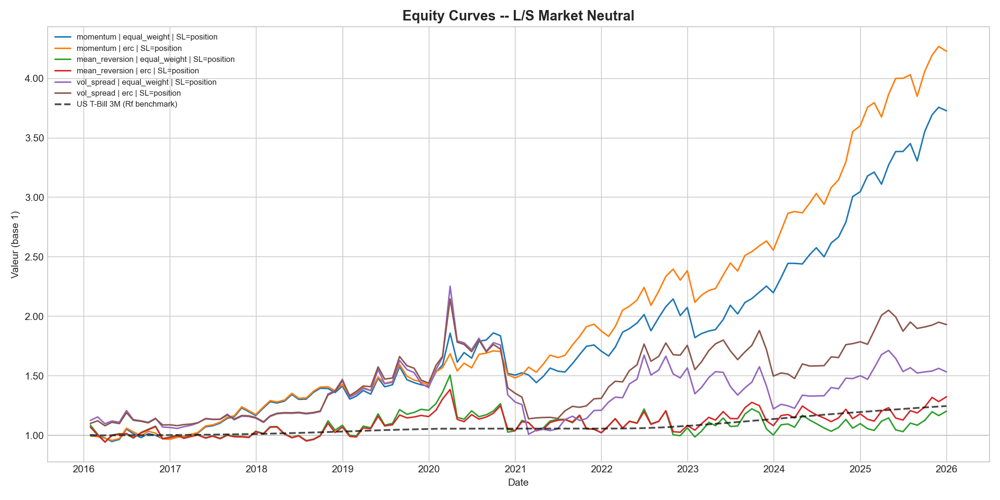

**Description** : Évolution de la valeur du portefeuille (base 1) pour chaque stratégie, comparée au benchmark US T-Bill 3M (courbe noire en pointillés). Ce graphique est le **livrable principal** du backtest.

**Lecture** :
- Chaque courbe représente une combinaison signal × allocation
- La courbe en pointillés noire représente le rendement cumulé du taux sans risque
- Une stratégie performante doit être au-dessus du benchmark risk-free

---

### 10.2 Drawdowns

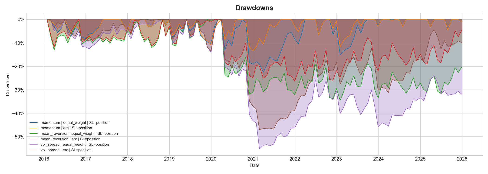

**Description** : Perte cumulée depuis le dernier sommet pour chaque stratégie. Ce graphique mesure le **risque de perte maximale**.

**Lecture** :
- Les zones colorées représentent les périodes de drawdown
- Plus les zones sont profondes, plus la perte maximale est importante
- Un bon gestionnaire de risque cherche à limiter la profondeur et la durée des drawdowns

---

### 10.3 Rolling Sharpe Ratio (12 mois)

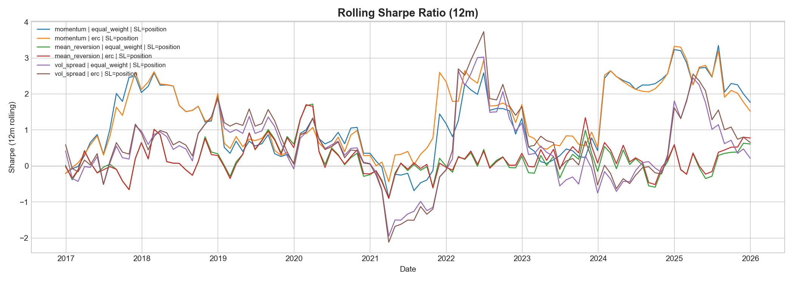

**Description** : Sharpe Ratio calculé sur une fenêtre glissante de 12 mois. Permet de voir **l'évolution de la qualité du rendement ajusté au risque** dans le temps.

**Lecture** :
- Un Sharpe > 0 indique un excès de rendement par rapport à la volatilité
- Les variations montrent la stabilité (ou l'instabilité) de la performance
- La ligne grise à 0 sépare les périodes rentables des périodes de sous-performance

---

### 10.4 Distribution des Rendements Mensuels

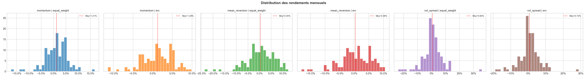

**Description** : Histogramme des rendements mensuels pour chaque stratégie. La ligne rouge verticale indique la **moyenne**.

**Lecture** :
- Une distribution centrée à droite de 0 indique une performance positive en moyenne
- La largeur de la distribution reflète la volatilité
- Les queues de distribution (fat tails) indiquent les risques extrêmes

---

### 10.5 Heatmap des Rendements Mensuels

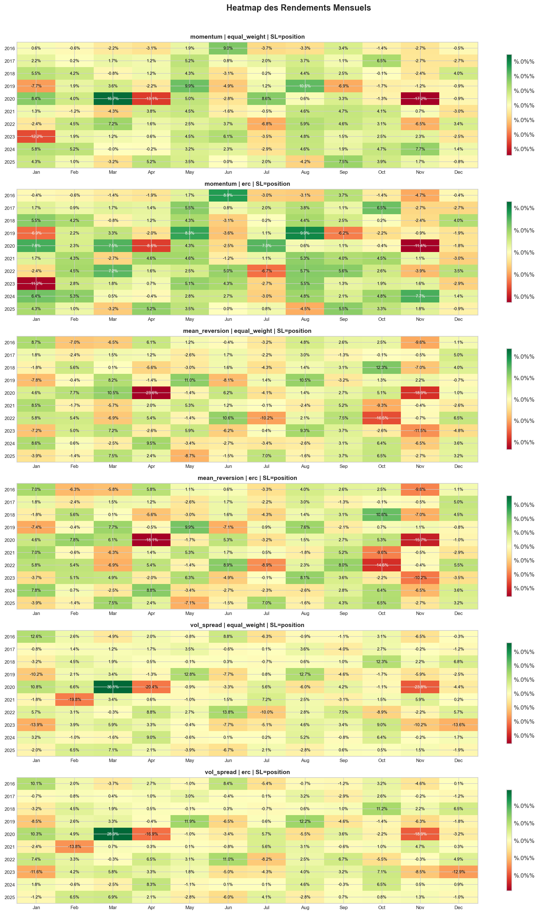

**Description** : Matrice année × mois avec le rendement de chaque mois en couleur (vert = positif, rouge = négatif). Permet d'identifier les **patterns saisonniers** et les mois de crise.

**Lecture** :
- Chaque cellule affiche le rendement du mois correspondant
- Les couleurs facilitent l'identification rapide des périodes de performance/sous-performance
- Utile pour repérer si certains mois sont systématiquement bons ou mauvais

---

### 10.6 Turnover Mensuel Moyen

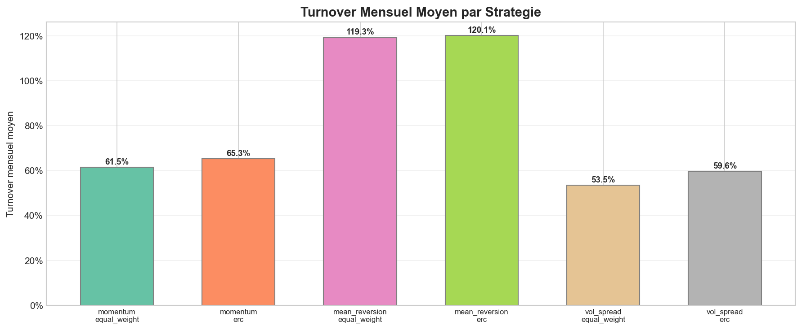

**Description** : Turnover mensuel moyen pour chaque stratégie. Un turnover élevé implique des **coûts de transaction plus importants**.

**Lecture** :
- Les barres représentent le turnover moyen par stratégie
- Un turnover de 50% signifie que la moitié du portefeuille est réallouée chaque mois
- Les stratégies momentum ont généralement un turnover plus faible que les stratégies de mean reversion

---

### 10.7 Matrice de Corrélation des Stratégies

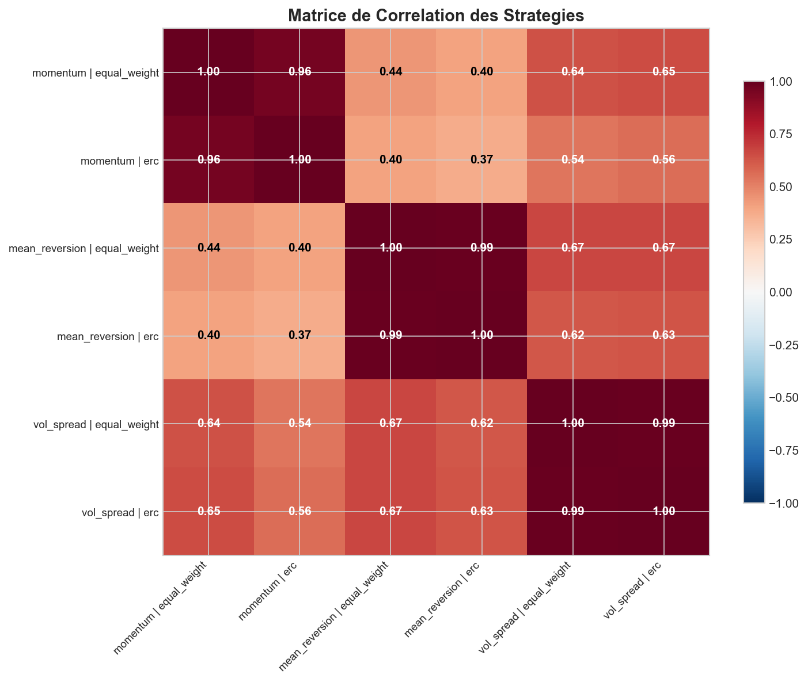

**Description** : Corrélation entre les rendements mensuels de chaque paire de stratégies. Utile pour évaluer le **potentiel de diversification**.

**Lecture** :
- Une corrélation proche de 1 (rouge) signifie que les stratégies se comportent de manière similaire
- Une corrélation proche de 0 ou négative (bleu) indique une bonne diversification
- Combiner des stratégies faiblement corrélées améliore le profil rendement/risque

---

### 10.8 Rendement Annuel par Stratégie

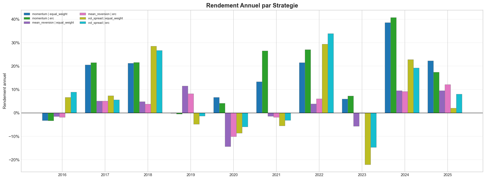

**Description** : Rendement annuel de chaque stratégie, année par année. Permet de voir la **consistance de la performance**.

**Lecture** :
- Les barres groupées comparent les stratégies pour chaque année
- Les années avec des barres au-dessus de 0 sont rentables
- La consistance (barres positives chaque année) est plus souhaitable qu'une forte moyenne avec des années très négatives

---

### 10.9 QQ-Plot vs Distribution Normale

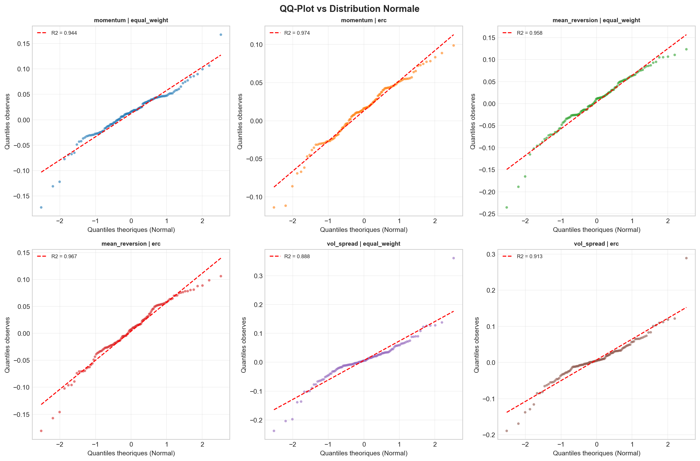

**Description** : Comparaison des quantiles observés des rendements avec les quantiles théoriques d'une distribution normale. Le $R^2$ mesure la **normalité** des rendements.

**Lecture** :
- Si les points sont alignés sur la droite rouge, les rendements suivent une loi normale
- Des déviations dans les queues indiquent des **fat tails** (risques extrêmes plus fréquents que prévu)
- Un $R^2$ proche de 1 indique une bonne adéquation avec la loi normale

---

### 10.10 Exposure (Nombre d'actions Long/Short)

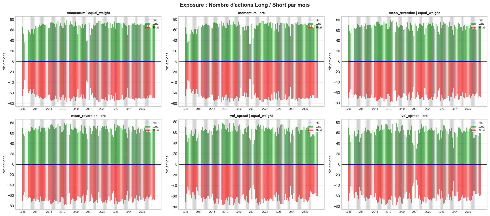

**Description** : Nombre d'actions dans les legs Long (vert) et Short (rouge) à chaque date de rebalancement, avec l'exposition nette en bleu.

**Lecture** :
- L'exposition nette (bleue) doit rester proche de 0 pour une stratégie market-neutral
- Le nombre d'actions varie en fonction de la composition de l'indice à chaque date
- Environ 100 actions Long et 100 Short (20% × ~500 composantes)

---

### 10.11 Underwater Plot (Drawdown avec durée)

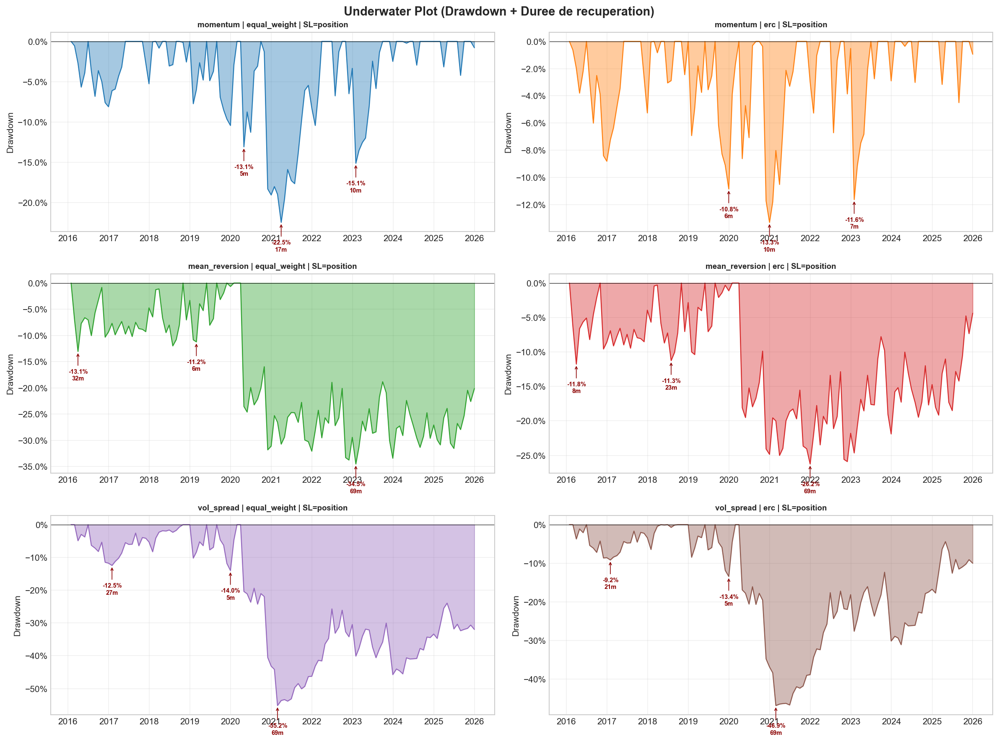

**Description** : Drawdown avec annotation de la **profondeur** et de la **durée** (en mois) des 3 pires drawdowns pour chaque stratégie.

**Lecture** :
- Les zones colorées montrent les périodes de perte
- Les annotations indiquent la profondeur maximale et le temps de récupération
- Un drawdown long et profond est plus dangereux qu'un drawdown court et léger

---

### 10.12 Export Excel

Le fichier `outputs/backtest_results.xlsx` contient :

| Feuille | Contenu |
|---------|---------|
| `Metrics` | Tableau comparatif de toutes les métriques pour chaque stratégie |
| `momentum_equal_weight` | PnL, NAV cumulée, turnover et coûts pour Momentum + EW |
| `momentum_erc` | PnL, NAV cumulée, turnover et coûts pour Momentum + ERC |
| `mean_reversion_equal_weight` | PnL, NAV cumulée, turnover et coûts pour Mean Rev + EW |
| `mean_reversion_erc` | PnL, NAV cumulée, turnover et coûts pour Mean Rev + ERC |
| `vol_spread_equal_weight` | PnL, NAV cumulée, turnover et coûts pour Vol Spread + EW |
| `vol_spread_erc` | PnL, NAV cumulée, turnover et coûts pour Vol Spread + ERC |

---

## 11. Conclusion

### Synthèse de l'infrastructure

Ce projet implémente une infrastructure de backtest **complète et modulaire** pour des stratégies Long/Short market-neutral :

- **3 signaux** cross-section basés sur les prix (Momentum, Mean Reversion de Volatilité, Vol Spread)
- **2 méthodes d'allocation** market-neutral (Equal Weight, ERC)
- **4 variantes de stop-loss** (Position, Trailing, Portfolio, Volatility-based)
- **Coûts de transaction réalistes** (10 bps)
- **10+ métriques de performance** avec taux sans risque réel (US T-Bill 3M)
- **11 graphiques** de visualisation + export Excel

### Points de robustesse

1. **Pas de look-ahead bias** : les signaux utilisent uniquement les données disponibles à chaque date
2. **Survivorship bias contrôlé** : composition de l'indice reconstituée à chaque date
3. **Gestion des données manquantes** : filtrage rigoureux du taux de NaN
4. **Market-neutral strict** : exposition dollar neutre ($\Sigma w^+ = +1$, $\Sigma w^- = -1$)
5. **Coûts intégrés** : le turnover et les frais de transaction sont déduits du PnL

### Technologies utilisées

| Composant | Technologie |
|-----------|-------------|
| Langage | Python 3.10+ |
| API Bloomberg | xbbg, blpapi |
| Calcul numérique | NumPy, Pandas |
| Optimisation | SciPy (SLSQP) |
| Visualisation | Matplotlib |
| Export | openpyxl (Excel) |
| Calendrier boursier | pandas_market_calendars |

---

## Annexe — Paramètres de Configuration (`config.py`)

| Paramètre | Valeur | Description |
|-----------|--------|-------------|
| `START_DATE` | 2016-01-01 | Début du backtest (après 12 mois pour le momentum) |
| `END_DATE` | 2025-12-31 | Fin du backtest |
| `MIN_HISTORY_MONTHS` | 12 | Historique minimum requis par ticker |
| `QUANTILE_LONG` | 0.20 | Top 20% → Long |
| `QUANTILE_SHORT` | 0.20 | Bottom 20% → Short |
| `TRANSACTION_COST_BPS` | 10 | Coût de 10 bps par transaction |
| `STOPLOSS_POSITION` | −10% | Seuil de stop-loss par position |
| `STOPLOSS_TRAILING` | −8% | Seuil de trailing stop |
| `STOPLOSS_PORTFOLIO` | −15% | Seuil de drawdown portefeuille |
| `STOPLOSS_VOL_WINDOW` | 60 | Fenêtre de volatilité (jours) |
| `STOPLOSS_VOL_MULT` | 2.0 | Multiplicateur de volatilité |
| `REBAL_FREQ` | M | Rebalancement mensuel (fin de mois) |
